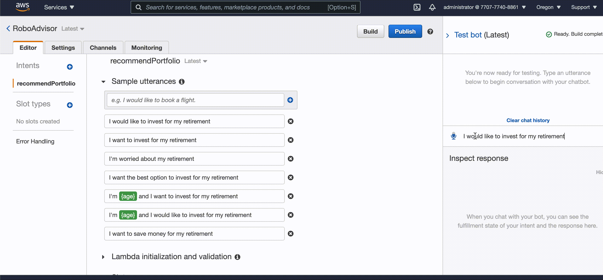

# RoboAdvisor - NLP

As a digital transformation consultant in one of the most prominent retirement plan providers in the country, I'm tasked with a very important challenge. The company wants to increase their client portfolio—especially by engaging young people. Because machine learning and NLP are disrupting finance to improve the customer experience, I decided to create a robo advisor. Both existing and potentially new customers will be able to use this robo advisor to get investment portfolio recommendations for retirement.

---

## Technologies

We won’t install any software on our computer. Instead, let's use the following AWS services to complete this challenge. 

AWS Billing

Amazon Simple Storage Service (Amazon S3)

Amazon SageMaker

Amazon Lex

Amazon Lambda

AWS Identity and Access Management (IAM)

---

## Usage

The following tasks are required to complete:

- Configure the initial robo advisor: Define an Amazon Lex bot with a single intent that establishes a conversation about requirements to suggest an investment portfolio for retirement.

- Build and test the robo advisor: Make sure that the bot works and accurately responds during the conversation with the user.

- Enhance the robo advisor with an Amazon Lambda function: Create an Amazon Lambda function that validates the user's input and returns the investment portfolio recommendation. This includes testing the Amazon Lambda function and integrating it with the bot.

---

## Final Outcome

- A Python script with the final Lambda function.

- Two short videos that demo the robo advisor in action from the “Test bot” pane as requested. 

---

## Contributor

Brought to you by Edgar Coronado

---

## License

MIT